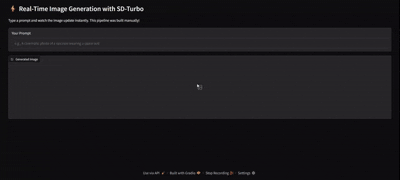

# ⚡ Live Diffusion Studio

  

A web application demonstrating real-time, interactive text-to-image generation using Stability AI's distilled Stable Diffusion Turbo (SD-Turbo) model. This project features a manually constructed model pipeline for greater control and understanding of the underlying architecture.

---

## 🚀 Live Demo


*A GIF showing the image updating instantly as the prompt is typed.*

---

## ✨ Features

-   **Real-Time Generation:** See images appear and update almost instantly with each keystroke.
-   **Manual Pipeline Construction:** The model pipeline is built from individual components (VAE, U-Net, Text Encoder, etc.) for deeper insight and control, rather than relying on a high-level autopipeline.
-   **Interactive UI:** A simple and intuitive web interface built with Gradio.
-   **Optimized Model:** Leverages the distilled SD-Turbo model for efficient single-step image creation.
-   **Local & GPU-Accelerated:** Runs entirely on a local machine, using an available NVIDIA GPU for fast inference.

---

## 🛠️ Tech Stack

-   **Python**
-   **PyTorch**: The core deep learning framework for model operations.
-   **Hugging Face `diffusers`**: Used to load model components and build the pipeline.
-   **Hugging Face `transformers`**: Provides the text encoder for understanding prompts.
-   **Gradio**: For creating the interactive web user interface.

---

## ⚙️ Setup and Installation

Follow these steps to get the project running on your local machine.

### Prerequisites

-   An NVIDIA GPU with CUDA installed.
-   Python 3.8+

### Steps

1.  **Clone the Repository**
    ```bash
    git clone https://github.com/DeveshPant18/Realtime-SD-Turbo.git
    cd YOUR_REPO_NAME
    ```

2.  **Create and Activate a Virtual Environment**
    ```bash
    # Create the virtual environment
    python -m venv venv

    # Activate it (command differs by OS)
    # On Windows (PowerShell):
    .\venv\Scripts\Activate.ps1
    # On macOS/Linux (Bash):
    source venv/bin/activate
    ```

3.  **Install Dependencies**
    First, install the correct version of PyTorch for your CUDA setup using the official command from the [PyTorch website](https://pytorch.org/get-started/locally/). Then, install the remaining packages.
    ```bash
    # Example for CUDA 12.1 - replace if needed
    pip install torch torchvision torchaudio --index-url [https://download.pytorch.org/whl/cu121](https://download.pytorch.org/whl/cu121)

    # Install the rest of the requirements
    pip install -r requirements.txt
    ```

---

## ▶️ How to Run

With your virtual environment active, run the main application script from the project's root directory:

```bash
python app.py
```


## 🙏 Acknowledgments

- **Stability AI** for creating the powerful **SD-Turbo** model.
- **Hugging Face** for their incredible **diffusers** and **transformers** libraries.
- The **Gradio** team for their easy-to-use UI framework.
